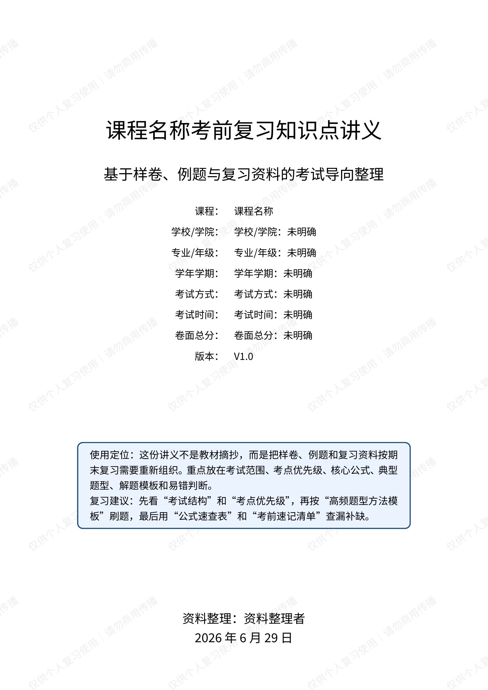
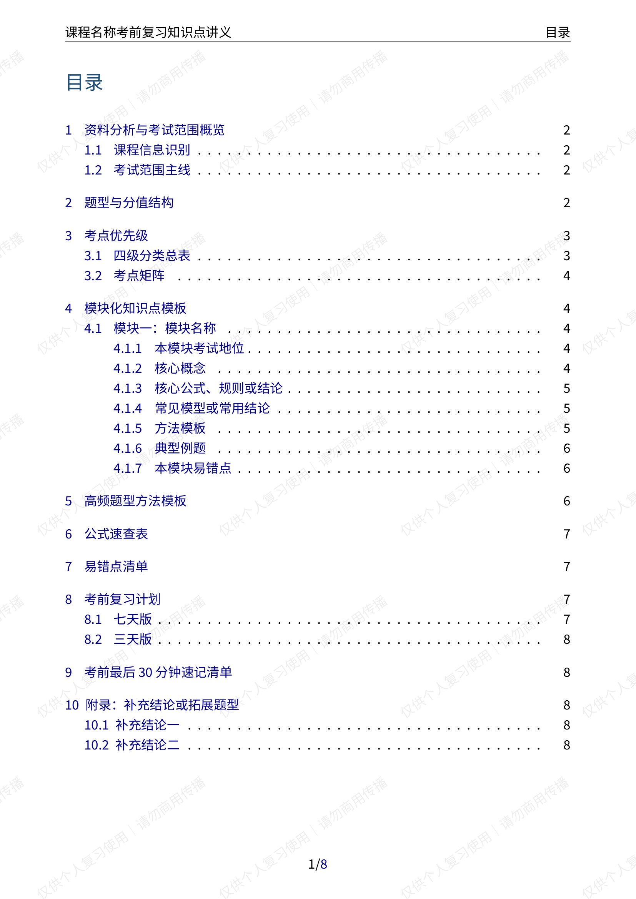
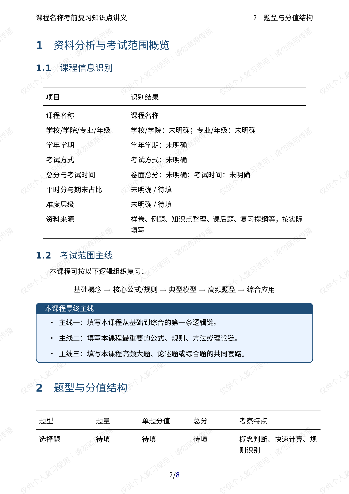
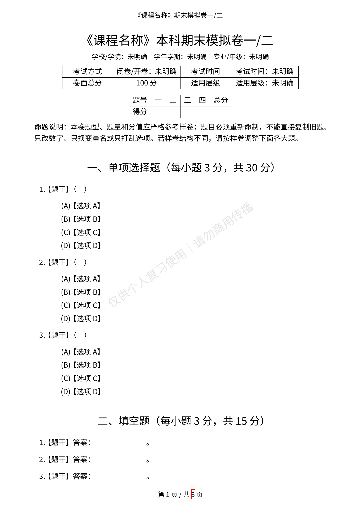
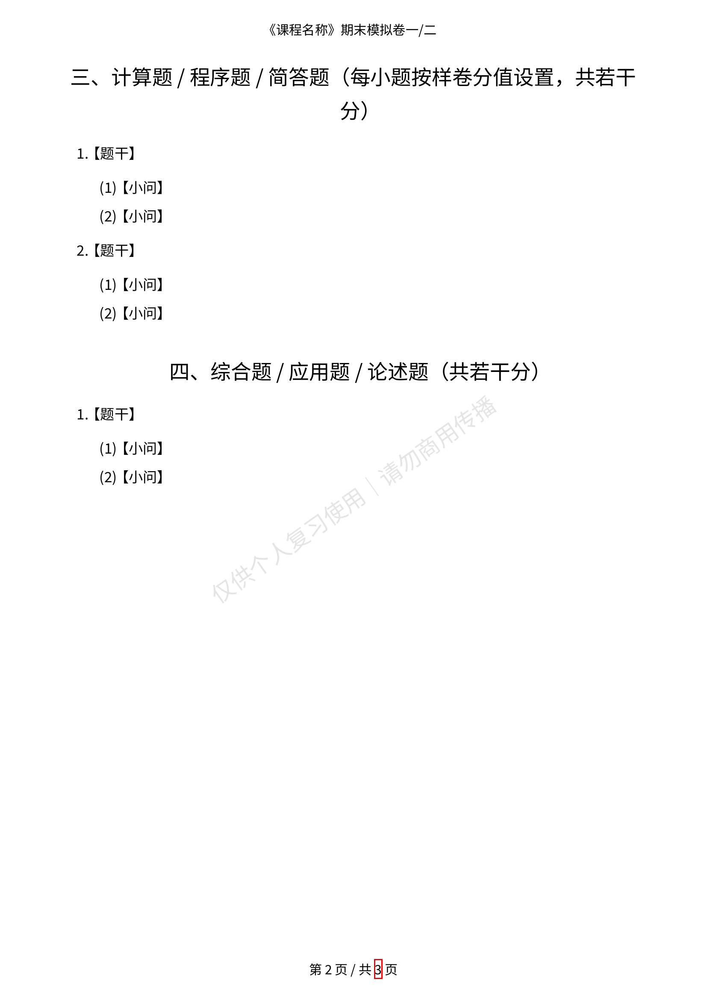

# 📚 Final Review Template Kit

> 通用学科期末复习包模板 — 给 AI 一套样卷，它还你一份完整的考前冲刺资料

[](LICENSE)
[](https://www.latex-project.org/)
[](#方式一配合-ai-agent-使用推荐)

## 这是什么？

一套 **学科无关** 的期末复习资料生成模板。把任意课程的样卷、复习提纲、课件丢给 AI，它能帮你产出：

| 产出物 | 说明 |
|--------|------|
| 📖 **考前复习知识点讲义** | 考点优先级 + 核心公式 + 方法模板 + 易错点 + 复习计划 |
| 📝 **模拟卷一** | 严格匹配样卷题型/分值，全新命制题目 + 完整答案解析 |
| 📝 **模拟卷二** | 考点错开、难度相当的第二套卷 + 完整答案解析 |
| 📦 **期末复习包 ZIP** | 以上三份 PDF 打包交付 |

适用于：数学 · 物理 · 计算机 · 英语 · 人文社科 · 经管法 · 医学 · 任何学科。

## 预览

### 复习知识点讲义





### 模拟卷




## 目录结构

```
final-review-template-kit/
├── README.md
├── LICENSE
├── .gitignore
├── templates/
│   ├── final-review-notes-template.tex    # 复习知识点讲义模板
│   └── final-mock-exam-template.tex       # 模拟卷模板
└── skills/
    └── subject-final-review/
        └── SKILL.md                       # Agent Skill 定义
```

## 快速开始

### 方式一：配合 AI Agent 使用（推荐）

把下面这段话连同 Skill 文件内容一起丢给你的 AI Agent（Claude Code、Codex、Trae、Cursor、Hermes 等都行）：

```
请阅读这个 Skill 定义并按流程执行：
https://raw.githubusercontent.com/jry21223/final-review-template-kit/main/skills/subject-final-review/SKILL.md

我上传了 [课程名称] 的样卷/复习资料，请帮我生成完整期末复习包。
```

Agent 会自动下载 Skill、分析材料、生成讲义和模拟卷。

### 方式二：手动使用 LaTeX 模板

```bash
# 1. 复制模板到课程工作目录
cp templates/*.tex ~/my-course-review/

# 2. 编辑 .tex 文件中的变量（课程名、学校、考试信息等）
# 3. 编译
cd ~/my-course-review/
xelatex final-review-notes-template.tex
xelatex final-review-notes-template.tex    # 两遍生成目录
```

## 模板变量一览

在 `.tex` 文件顶部修改这些变量：

| 变量 | 默认值 | 说明 |
|------|--------|------|
| `\CourseName` | `课程名称` | 替换为实际课程名 |
| `\SchoolInfo` | `学校/学院：未明确` | 学校和学院 |
| `\MajorInfo` | `专业/年级：未明确` | 专业与年级 |
| `\TermInfo` | `学年学期：未明确` | 如 `2025-2026学年第二学期` |
| `\ExamType` | `考试方式：未明确` | 闭卷/开卷 |
| `\ExamTime` | `考试时间：未明确` | 如 `120分钟` |
| `\TotalScore` | `卷面总分：未明确` | 如 `100分` |
| `\WatermarkText` | `仅供个人复习使用｜请勿商用传播` | 水印文案 |
| `\showwatermarktrue` | 启用 | 改为 `\showwatermarkfalse` 关闭水印 |

## 讲义包含的板块

| # | 板块 | 作用 |
|---|------|------|
| 1 | 考试范围概览 | 课程主线：基础→核心→综合 |
| 2 | 题型与分值结构 | 和样卷严格一致的结构表 |
| 3 | 考点优先级 | 🔴必考 🟡高频 🟠可能 🟢了解 |
| 4 | 模块化知识点 | 每模块：概念+公式+模型+方法模板+例题+易错点 |
| 5 | 高频题型方法模板 | 识别特征→固定步骤→常用公式→易错点 |
| 6 | 公式速查表 | 按模块整理，一表查完 |
| 7 | 易错点清单 | 错误表现 vs 正确做法 |
| 8 | 七天复习计划 | Day 1~7 每天任务 |
| 9 | 三天冲刺版 | 时间不够的精简方案 |
| 10 | 考前速记清单 | 最后 30 分钟扫一遍 |

## 输出文件命名

```
{{课程名称}}_考前复习知识点讲义.pdf
{{课程名称}}_模拟卷一_含答案解析.pdf
{{课程名称}}_模拟卷二_含答案解析.pdf
{{课程名称}}_期末复习包.zip
```

## LaTeX 编译环境

**推荐：** XeLaTeX（需要 CJK 字体支持）

```bash
# Ubuntu/Debian 安装中文支持
sudo apt install texlive-xetex texlive-lang-chinese fonts-noto-cjk

# macOS（MacTeX 自带 CJK 支持）
# Windows（TeX Live 完整安装即可）
```

**字体配置：** 模板默认使用 Noto CJK。如果系统没有，改用：

```latex
% 思源字体
\setCJKmainfont{Source Han Serif SC}
\setCJKsansfont{Source Han Sans SC}

% Windows 系统字体
\setCJKmainfont{SimSun}
\setCJKsansfont{SimHei}
```

## 安全发布检查

发布到公开仓库前，确保没有敏感信息：

```bash
# 扫描个人信息残留
grep -RInE "姓名|学号|手机号|微信|QQ|邮箱|密码|secret|token|api[_-]?key" .

# 扫描学校/教师信息残留
grep -RInE "真实姓名|个人署名|学校全称|学院全称|教师姓名" .
```

- ✅ 占位符可以保留（如 `{{课程名称}}`、`未明确`）
- ❌ 真实姓名、学号、手机号、试卷原图、付费资料必须移除
- ❌ 不提交真实试卷扫描件、内部答案、未经授权的版权内容

## 设计原则

- **学科无关** — 不绑定数学/计算机/任何单一学科
- **考试导向** — 讲义按考点优先级组织，不是教材摘抄
- **严格匹配** — 模拟卷的题型/题量/分值必须和样卷一致
- **原创出题** — 禁止复制旧题、改数字、换变量名、打乱选项
- **安全模板** — 公开版本只含占位符，不含个人信息

## 作者

[styleliyu](https://github.com/styleliyu) · [jry21223](https://github.com/jry21223)

## License

[MIT](LICENSE)
